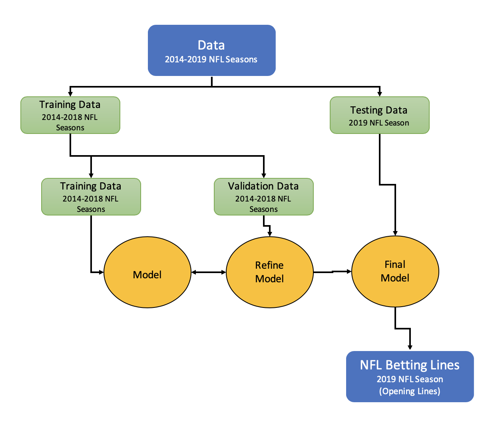
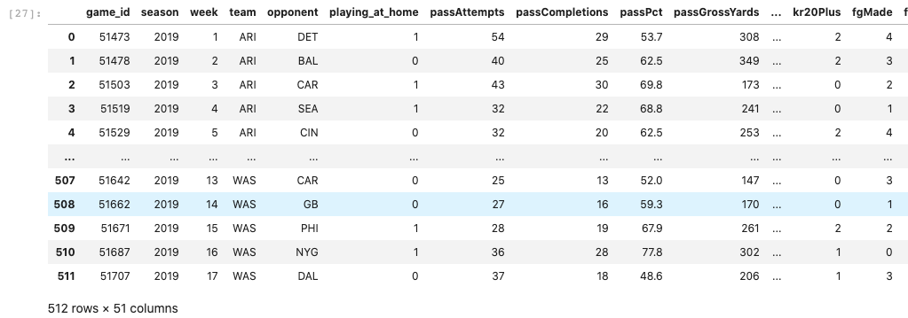
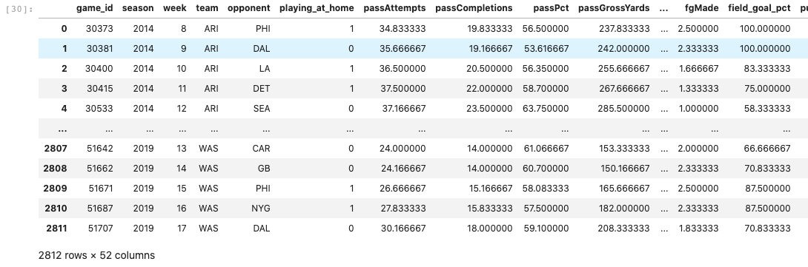
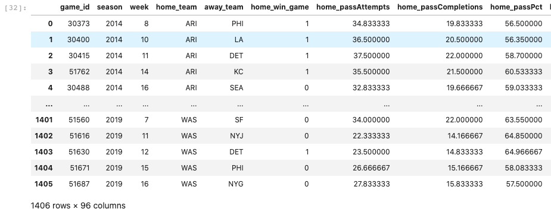
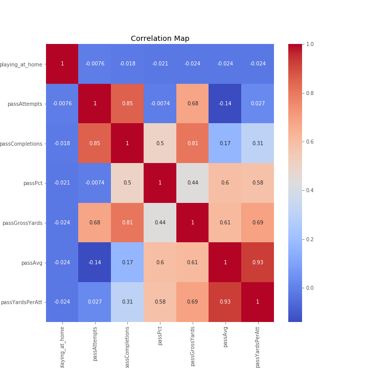

# NFL Game Predictor

## Table of Contents

- [Basic Overview](#basic-overview)
  - [Context](#context)
  - [Goal](#goal)
  - [Method](#method)
- [Exploring Data](#exploring-data)
  - [Initial Intake](#initial-intake)
  - [Feature Selection](#feature-selection)
- [Model Selection](#model-selection)
  - [Visualizations](#visualizations)
- [Future Considerations](#future-considerations)
- [License](#license)

## Basic Overview

### Context

In the words of Danny Ocean from Ocean's 11

>"The house always wins. Play long enough, you never change the stakes, the house takes you. Unless, when that perfect hand comes along, you bet big, and then you take the house."

For anyone who has played sports gambling in their lives, they know one thing: it is incredibly difficult to beat the house. Even if you pick winners more than 50.1% of the time, you will still lose money in the long run.

### Goal

Develop an NFL game predictor that predicts which team will win the game. The model explores the important features of making the prediction.

Develop betting schemes that can maximize the chances of winning (beat Vegas).

### Method

The intent of this project is to make accurate future predictions. With that in mind, a model will be built using games from previous seasons and then predictions for the latest season, 2019, will be analyzed for determining if this model should be used to beat Vegas.

## Exploring Data

### Initial Intake

Data was taken from API provided by https://www.mysportsfeeds.com/. For each team in seasons 2014-2019, approximately 50 stats for each game was stored. The function 'obtain_stats.py' will get the stats from the API. Here is an example of the CSV file that was created:

One of the goals of this project is to predict future games. So stats from the current game cannot be used to predict whether or not that team won (i.e., target leakage). 

The function 'nfl_stats_aggregator.py' takes previous games and averages the stats. I started with aggregating the previous six games. When calling the AggregatedStats class, the number of games to aggregate across can be changed.

Once the stats were aggregated for each team, the away team and home team and to merged into one row for a single row. This was done by merging the dataframe on game_id.

### Feature Selection

A heat map was used to find highly correlated stats. For example, as shown below, 'passAvg' and 'passYardPerAtt' were (obviously) very correlated. Based off this, fourteen features were removed.

A goal of this study was to find if I could accurately predict important features using my domain knowledge of the NFL.

For each game, I predicted that the following would be the most important features:
| Features      | Features       |
| ------------- | -------------  |
| Team Score    | Opponent Score |
| QB Rating     | Sacks          |
| Interceptions | Passing TDs    |
| Fumbles       | Wins Past Games|
| Passing Ints  |                |

