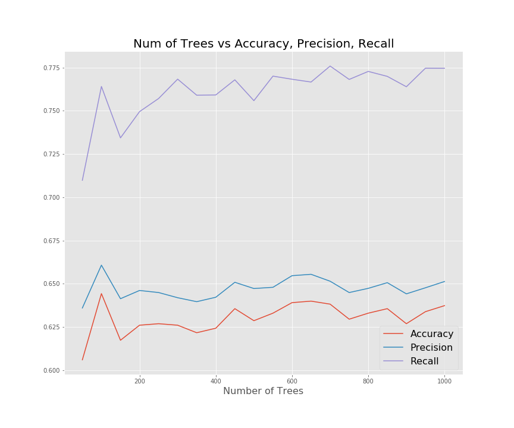

# NFL Game Predictor

## Table of Contents

- [Basic Overview](#basic-overview)
  - [Context](#context)
  - [Goal](#goal)
  - [Method](#method)
- [Exploring Data](#exploring-data)
  - [Initial Intake](#initial-intake)
  - [Feature Selection](#feature-selection)
- [Model Selection](#model-selection)
  - [Logistic Regression](#logistic-regression)
  - [Random Forest](#random-forest)
- [Future Considerations](#future-considerations)
- [License](#license)

## Basic Overview

### Context

In the words of Danny Ocean from Ocean's 11:

>"The house always wins. Play long enough, you never change the stakes, the house takes you. Unless, when that perfect hand comes along, you bet big, and then you take the house."

For anyone who has played sports gambling in their lives, they know one thing: it is incredibly difficult to beat the house. Even if you pick winners more than 50.1% of the time, you will still lose money in the long run.

### Goal

Develop an NFL game predictor that predicts which team will win the game. The model explores the important features of making the prediction.

Develop betting schemes that can maximize the chances of winning (beat Vegas).

### Method

The intent of this project is to make accurate future predictions. With that in mind, a model will be built using games from previous seasons and then predictions for the latest season, 2019, will be analyzed for determining if this model should be used to beat Vegas.

## Exploring Data

### Initial Intake

Data was taken from API provided by https://www.mysportsfeeds.com/. For each team in seasons 2014-2019, approximately 50 stats for each game was stored. The function 'obtain_stats.py' will get the stats from the API. Here is an example of the CSV file that was created:

One of the goals of this project is to predict future games. So stats from the current game cannot be used to predict whether or not that team won (i.e., target leakage). 

The function 'nfl_stats_aggregator.py' takes previous games and averages the stats. I started with aggregating the previous six games. When calling the AggregatedStats class, the number of games to aggregate across can be changed.

Once the stats were aggregated for each team, the away team and home team had to be merged into one row for a single row. This was done splitting the dataframe based on if the team was playing at home or away, then merging the two dataframes on game_id.

### Feature Selection

A heat map was used to find highly correlated stats. For example, as shown below, 'passAvg' and 'passYardPerAtt' were (obviously) very correlated. Based off this, fourteen features were removed.

A goal of this study was to find if I could accurately predict important features using my domain knowledge of the NFL.

For each game, I predicted that the following would be the most important features:
| Rank         | Features                  |
| -------------| -------------             |
| 1            | Home_Team_Score           |
| 2            | Away_Team_Score           |
| 3            | Home_Team_Opponent_Score  |
| 4            | Away_Team_Opponent_Score  |
| 5            | Home_Team_QB_Rating       |
| 6            | Away_Team_QB_Rating       |
| 7            | Home_Team_Wins_Past_Games |
| 8            | Away_Team_Wins_Past_Games |
| 9            | Home_Team_Sacks           |
| 10           | Away_Team_Sacks           |

## Model Selection

### Logistic Regression

This is a classification problem, with my target being if the home team won (1) or lost (0). First, I looked at a logistic regression model but scrapped that quickly when p-values for the various features were all above 0.05 (most well above that threshold).

### Random Forest

I then looked at a random forest model and using the training data using only the stats that I proposed were important, varied the number of trees and used a 5 K-Fold split to get an average of the accuracy. The accuracy, precision, and recall is shown on the plot below vs the number of trees. For this project, we really only care about accuracy. The accuracy for this set is right around 62% even as the number of trees increase.

Then using all of the stats available, the number of trees were varied and used a 5 K-Fold split again to get an average of the accuracy.

As shown, the accuracy doesn't improve by much even by adding in all of the extra features. Also, as shown, good number of trees to choose is 500 for this model.

The full model was built using all of the data from 2014-2018 seasons to develop the important features that the Random Forest found as well as developing an ROC curve to compare against other models.

According to the Random Forest model, the following features were most important:

| Rank         | Features                  |
| -------------| -------------             |
| 1            | Away_Team_Score           |
| 2            | Home_Team_Wins_Past_Games |
| 3            | Home_Team_Score           |
| 4            | Home_Team_Opponent_Score  |
| 5            | Away_Team_QB_Rating       |
| 6            | Home_Team_QB_Rating       |
| 7            | Home_Sacks_Allowed        |
| 8            | Home_Third_Down_Pct       |
| 9            | Away_Third_Down_Pct       |
| 10           | Away_Sacks_Allowed        |

And finally for the Random Forest model, the ROC curve and AOC score:

